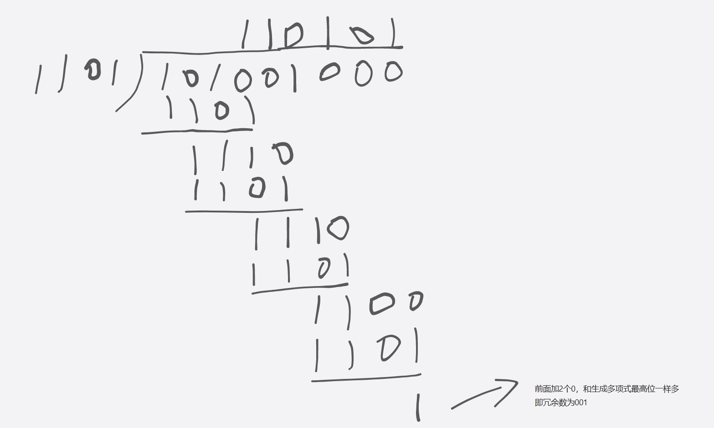
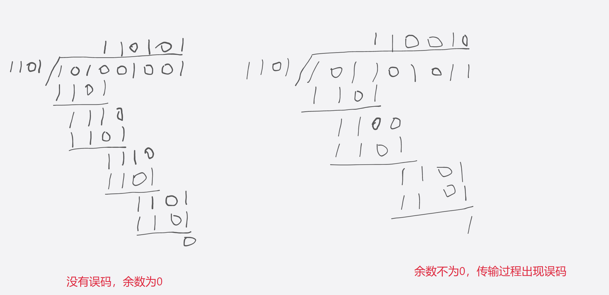

# 3 数据链路层
## 3.1 数据链路层概述
### 3.1.1 数据链路层在网络中所处的地位
数据链路层的主要任务是实现帧在一段链路或者一个网络上进行传输的问题。数据链路层位于OSI模型的第二层
### 3.1.2 链路、数据链路和帧
**链路**：是指一个节点到相邻节点的一段物理线路(有线或无线)，中间没有其他任何交换节点。  

**数据链路**：数据链路基于链路，数据链路=通信协议+链路。比如网卡，实现了数据链路层协议的软件和硬件加到链路上，就构成了数据链路。  

**帧**：是数据链路层对等实体之间在水平方向进行逻辑通信的协议数据单元PDU。就是数据链路层的传输数据格式。  

---
## 3.2 数据链路层的三个重要问题
### 3.2.1 封装成帧和透明传输
**封装成帧**：网络层交付下来的分组添加一个首部和尾部，构成一个帧。   

**帧首部包含**：帧开始符、帧的源地址和目的地址。帧尾部包含：帧校验序列和帧结束符。  

**透明传输**：解决数据载荷部分也出现帧定界符的错误。解决这种问题有：字节填充和比特填充。

**字节填充**：出现帧定界符前面插入转义符。

**比特填充**：5个连续比特1后面增增加比特0
### 3.2.2 差错检测
比特信号在传输过程中出现失真，使得比特1变成比特0，或者比特0变成比特1，这种传输差错称为比特差错。为了检测帧在传输过程中是否出现了误码，在帧的尾部存放检查码字段称为帧检验序列（FCS）。   

**1.奇偶校验**

奇校验是在待发送数据后面添加一个校验位，是的整个数据包括校验位中的1的个数为奇数。

偶校验是在待发送数据后面添加一个校验位，是的整个数据包括校验位中的1的个数为偶数。

**2.循环冗余校验(CRC)**

**循环冗余校验的基本思想:**  
- 收发双方约定一个生成多项式。
- 发送方基于待发送数据和多项式计算出检测码即冗余码放在待发送数据中一起传输。
- 接收方收到数据后通过一样的生成多项式计算数据是否产生误码。

假设约定的生成多项式为：$G(X)= X^3+X^2+1$，待发送数据为1011001。

**发送方使用CRC的操作：**
- 待发送数据作为被除数一部分，后面添加生成多项式$G(X)$最高次数个0构成被除数。这里最高次数是3，所以被除数为1011001000
- 生成多项式$G(X)$各项系数构成的比特串作为除数。这里生成多项式$G(X)=$$1\times X^3 + 1 \times X^2 + 0 \times X^1 + 1 \times X^0$，则除数为1101
- 进行二进制模2出发，得到商和余数。余数就是冗余码，冗余码长度应该与多项式最高次数相同，如下图所示，则冗余码为001。
- 将冗余码添加到待发送数据的后面一起发送。

**接收方使用CRC的操作：**
- 构造被除数：将收到的数据包含冗余码作为被除数。假设传输过程中没有误码，则收到的数据为101001001，假设传输过程中出现了误码，收到的数据假设为101101011。
- 构造除数：生成多项式的各系数构成的比特串作为除数，即是1101.
- 检查余数：余数为0，则判定传输过程中没有误码。余数不为0，则判定传输过程中出现了误码。如下图所示：

 

**在实际应用中，常采用以下国际标准生成多项式：**  

CRC-16 = $X^{16} + X^{15} + X^2 + 1$   

CRC-CCITT = $X^{16} + X^{12} + X^5 + 1$  

CRC-32 = $X^{32} + X^{26} + X^{23} + X^{22} + X^{16} + X^{12} + X^{11} + X^{10} + X^{8} + X^{7} + X^{5} + X^{4} + X^{2} + X + 1$  

**循环冗余校验要求生成多项式中必须包含最低次项$X^0$，也就是1。**

### 3.2.3 可靠传输

---
## 3.3 点对点协议
## 3.4 共享式以太网
## 3.5 交换式以太网
## 3.6 以太网的MAC帧格式
## 3.7 虚拟局域网
## 3.8 以太网的发展
## 3.9 802.11无线局域网